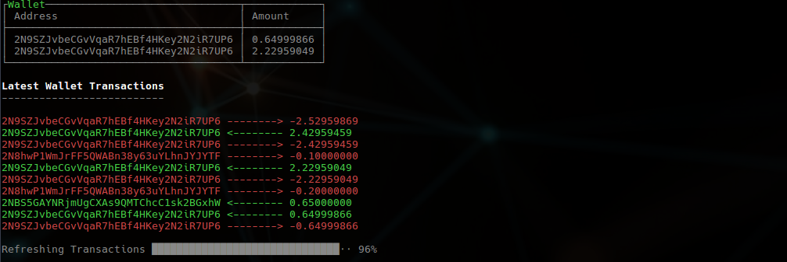

## Terminal Wallet

Terminal wallet is a simple tracker for your Bitcoin wallet. It's meant to be used with Bitcoin Core RPC API.

### Requirements

	progress==1.3
	python_bitcoinrpc==1.0
	colorclass==2.2.0
	terminaltables==3.1.0

or

	pip install requirements.txt

### Setup
Change the rpc credentials and server IP, and you're good to go. 
